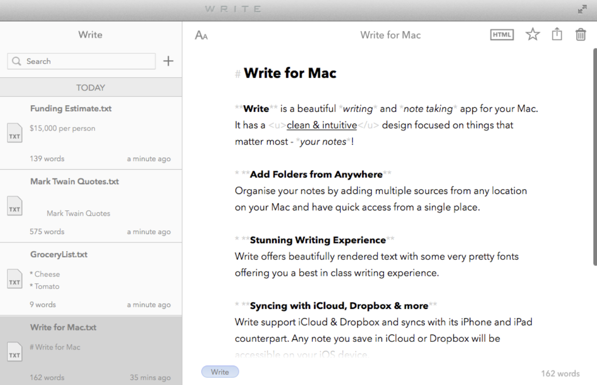
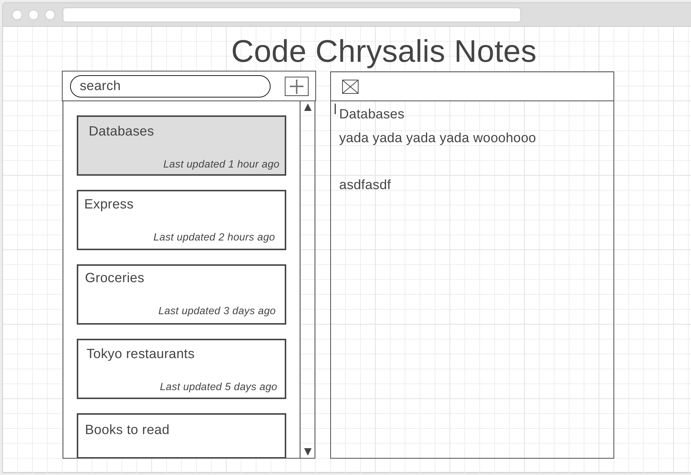
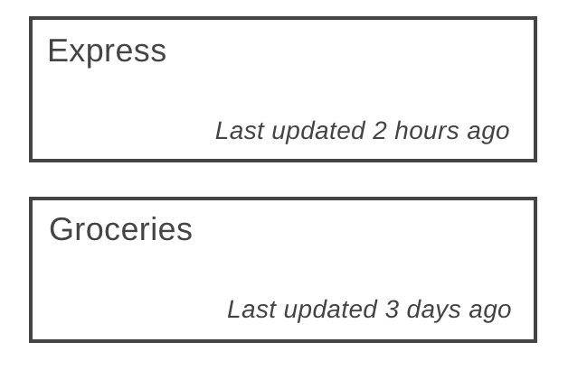
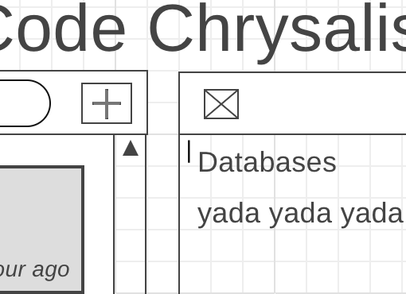
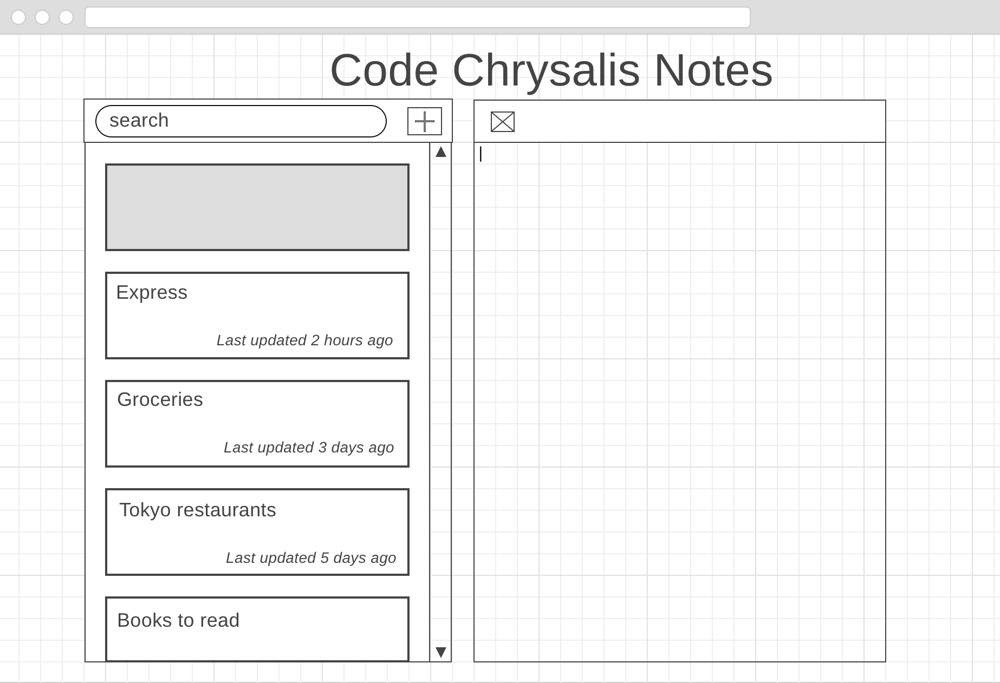
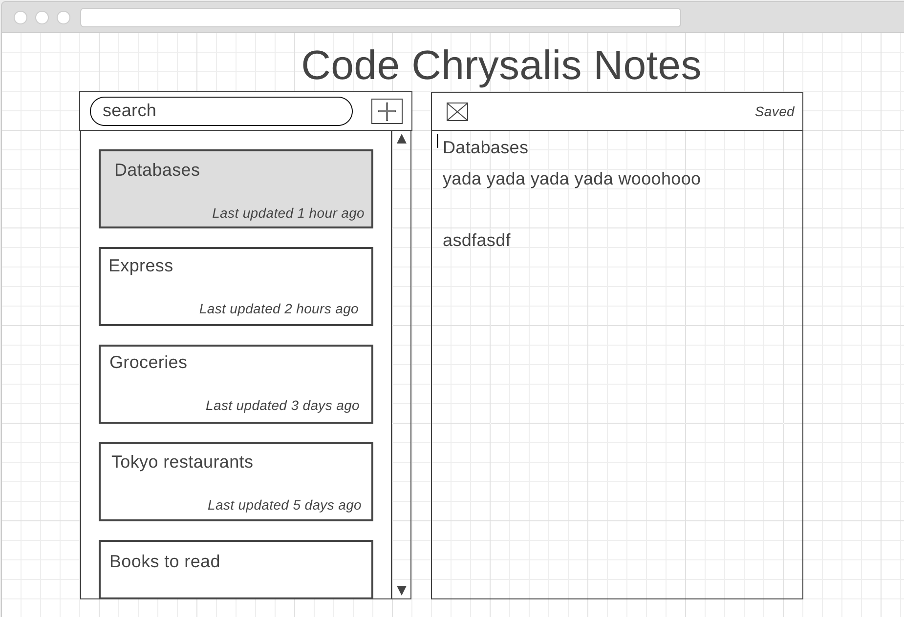

# 中間アセスメント パート 2

これは、中間試験のパート 2 です。今日の午後 6 時までにプルリクエストを行い、この試験の回答をサブミットしてください。
一般的なメモ作成アプリを作成します。早く終了したら、もっと他の機能を追加して、このアプリをさらに魅力的にしてみてください！

## ルール

1.  **Google を使うことは許されていますが、**

    - 道理をわきまえた上で利用することを許可します。
    - コードをコピー＆ペーストすることは許されていません。

2.  **（あなたまたは他の誰かによって）以前に書かれたコードを見たり、使用したりすることは許されていません。**

    - **以前のコードや単に名前を変更した変数をコピー/貼り付けすることは、不正行為と見なされ、深刻な結果をもたらします。**
    - **同様に、公式リソースからテキストをコピー/貼り付けして問題に回答することも不正行為と見なされます。**
      - あなた自身の言葉と考えをもとに回答するようにしましょう。

3.  それぞれの問題の評点を忘れないでください。
4.  テストは**任意**ですが、テストコードを書くことを強くお勧めします。

## プルリクエスト

プルリクエストを行うときに、`pull_request_template.md` 内の質問事項にしたがって回答してください。

上記のプルリクエストの詳細の中に、あなたのデプロイしたアプリの URL を書き加えてください。

## セットアップ

依存パッケージのインストール：`yarn`

サーバの起動：`yarn start`

フロントエンド向けの開発用サーバの起動：`yarn dev`

## 課題

作業を開始する前に説明文を読み、内容を理解してください。**不明な点がある場合は、すぐにインストラクターに質問してください。**

Heroku にデプロイするフルスタック Web アプリを作成します。技術スタックとしては、Postgres、Knex、React、Redux、Node/Express、および Heroku が含まれます。

**リポジトリ内のコードベース全体に散らばった質問もあるので、それらすべてに回答することも忘れないでください！**

以下のようなフルスタックのメモ作成アプリを作成します。

### フロントエンド

フロントエンドは正確に上記のような見た目にする必要はありませんが、できるだけ近づける努力をしてください。

始める前に、次のことを知っておいてください。

- すべてのフロントエンドのソースコードは `src` フォルダに配置する必要があります。
- すべての依存パッケージが `package.json` にリストアップされているわけではありません。

#### フロントエンドの基本的なユーザ要件（基礎レベル）

以下は、期待するユーザの動作です。すべてを最後まで詳細に実装する時間はないかもしれませんが、基本的なアクション（作成、読み込み、更新、削除）を実装できるかどうか評価したいと思います。

- 読み込み：ユーザは、左側にはノート（Note）カードのリストが、右側には現在選択されているノートのテキストを表示した、単一の入力テキストボックス（ノート作成スペース）が表示されるはずです。
  - ノート（Note）カードのリストは、時間に伴ってソートする必要があります（ワイヤーフレームを参照のこと）。
  - 各ノート（Note）カードには、ノートのタイトルと最終更新日時を表示する必要があります。
  - ノートのタイトルは、メモ作成スペースの最初の行から取得してください。最初の行が長すぎる場合は、ノート（Note）カードのタイトルに収まる最初の数文字のみを抜き出し、ノートのタイトルとしてください（ワイヤーフレームを参照）。
  - ノート（Note）カードをクリックすると、ノート作成スペースに選択したノートのテキストがレンダリングされ、選択したノート（Note）カードも強調表示されます（ワイヤーフレームを参照のこと）。
    
- 作成：ユーザが "Add" ボタン（+ ボタン）をクリックした場合、左側に空白のノート（Note）カードを作成し、右側に空白のノートスペースを作成する必要があります。
  - ノート作成スペースの最初の行が書き込まれると、左側の対応するノート（Note）カードが更新される必要があります。 
- 削除：ユーザはノート作成スペースの上にある "Delete" ボタン（× ボタン）をクリックできるはずです。
  - "Delete" ボタン（× ボタン）をクリックすると、リストからノートが削除される必要があります。
  - ノートを削除後、ノート作成スペースの現在のビューは、次に利用可能なノートがデフォルトになります。
- 更新：ユーザがノート作成スペースに書き込むことができる必要があります。
  - ユーザがノート作成スペースのノートの最初の行を更新すると、左側のノート（Node）カードのタイトルも更新される必要があります。
  - ノートは自動保存される必要があります。-- キーボードに動きがない場合は 5 秒ごとに、もしくは別のノートに切り替えた時、ノート作成スペースの上に "Saved" というテキストを表示する必要があります。
    - ヒント：どのように自動保存しますか？ "keyup"、"clearTimeout"、および"setTimeout" を確認してみましょう。
      

#### フロントエンドの応用レベル（要件）

- 検索バーを作成し、左側にノート（Note）カードのリストとして検索結果を表示してください。

### サーバサイド

#### サーバサイドの基礎レベル（要件）

- いくつかのサーバサードのソースコードはすでに用意されています。残りを記述してください。`server/server.js` には、回答する必要のある質問もあります。
- RESTful パターンに従って、指定されたすべての CRUD 操作のエンドポイントが必要となります。
  - ノートを作成する。
  - すべてのノートを一覧表示する。
  - 1 つのノートを読み込む。
  - ノートを更新する。
  - ノートを削除する。
- コントローラとモデルのロジックを分離する必要があります。コントローラのテストが容易になることを確認してください。
- サーバに対して、データベースのマイグレーションとシードを実行する必要があります。サーバがリッスンを開始する直前に、`server/index.js` ファイルにその情報（マイグレーションとシードの処理）を挿入してください。`knex` のドキュメントをチェックして、それら（マイグレーションとシード）を実行するための API を確認してください。シードとマイグレーションは非同期のアクションであることを忘れないでください。

#### サーバサイドの応用レベル（要件）

- 検索用のエンドポイントを追加してください。

### データベース

#### データベースの基礎レベル（要件）

1. `models/index.js` に、正しい接続情報を設定したシンプルな knex オブジェクトを用意しておきました。
2. 役に立つかもしれない `models/knexfile.js` と呼ばれるファイルもあります。ただし、接続情報が記述されていないため、それらを追加する必要があります。追加しないと、マイグレーションが機能しません。
3. データベースのシードファイルを作成してください。`data/notes.json` に、始めるのに役立つ簡単な JSON ファイルがあります。
4. データベースのマイグレーションファイルを作成してください。
5. エンドポイントにデータベースを接続してください！
6. `package.json` に 'migrate' スクリプトを配置してください。

#### データベースの応用レベル（要件）

- データベースに検索機能を追加してください！

### 質問事項

ファイル内の質問に必ず答えてください！

質問は次の場所にあります：

- `models/README.ja.md`
- `server/README.ja.md`

### デプロイメント

#### デプロイメントの基礎レベル（要件）

1. Heroku を使用してアプリをデプロイしてください。パイプラインを設定する必要はありません。
1. ヒント：アドオンとして Postgres を Heroku に追加することを忘れないでください！
1. **プルリクエストのときに、デプロイしたアプリへのリンクを記入してください。**

## 今回の試験で必要としない知識

- GraphQL

## 評価のポイント

私たちがこの課題で最も重視していることは、**要求されているフルスタックな機能を実装できているか** という点です。言い換えると、MVP を実践できているかという点です。時間を賢く使っているか思い出しましょう。

フルスタックな機能を満たしている限り、パッケージを追加したり、一からボイラープレートを作り直しても構いません。

課題に対するあなたの理解度は、以下の点から評価されます：

- コミットの質
- あなたの書いたコードが機能するかどうか
- コードスタイルと構成
- 回答した説明文
