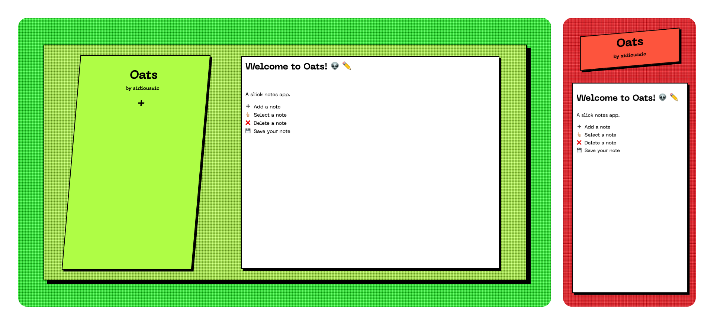

# Oats 🤑

Oats is a slick notes app. ✏️ 👍🏼

<a href="https://sidiousvic.dev/oats"></a>

<details>
<br>

<summary><b>Develop</b></summary>

## Cloning and installing dependencies

<br>

```sh
git clone https://github.com/sidiousvic/oats.git
```

```sh
yarn
```

## Setting up the backend

<br>

<a href="https://blog.timescale.com/tutorials/how-to-install-psql-on-mac-ubuntu-debian-windows/">Make sure to have `psql` installed.</a>

Bash into `psql` and create a database called `oats`.

Also create a database `oats_test` for the tests to use.

```bash
psql
```

```sql
CREATE DATABASE oats;
CREATE DATABASE oats_test;
```

Create an `.env` file and add your `psql` credentials.

```bash
touch .env
```

```
DB_USER=<yourUsername>
DB_PW=<yourPassword>
```

## Firing up development

<br>

Start the backend server.

```bash
yarn serve
```

Start the frontend server.

```bash
yarn dev
```

Hack away! 👽👍🏼🔥

</details>

<br>

Questions? 👉🏼 `sidiousvic@gmail.dev`
